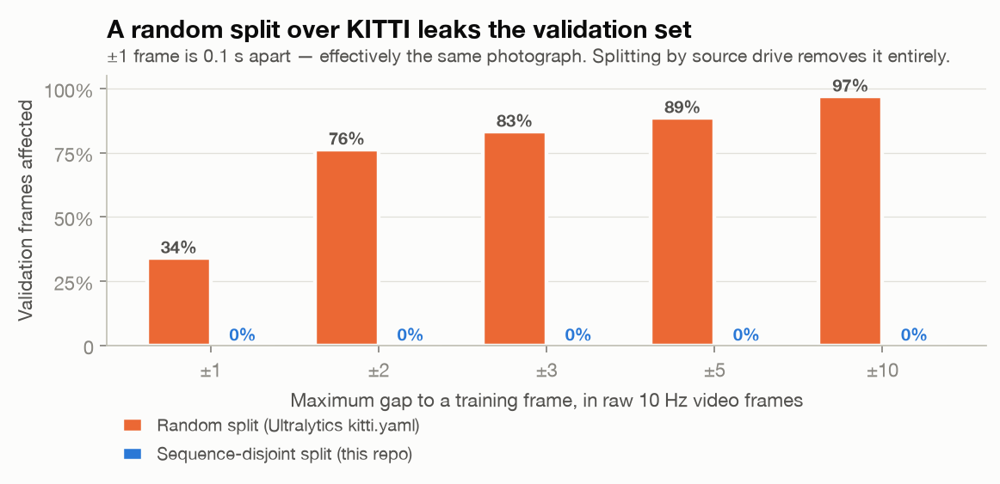
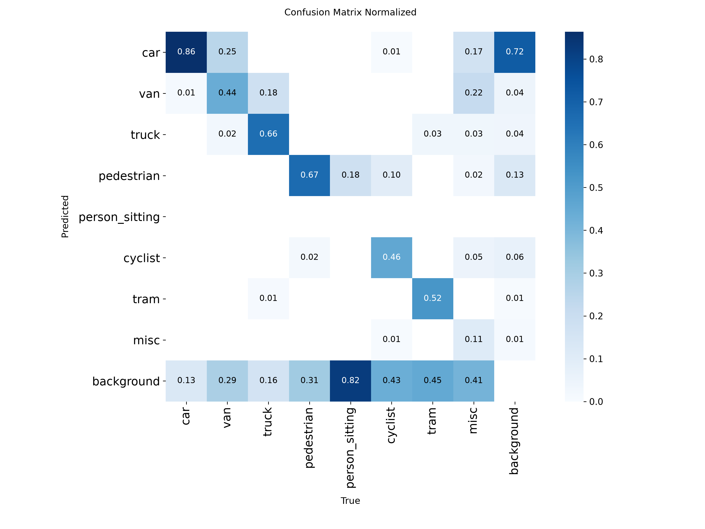
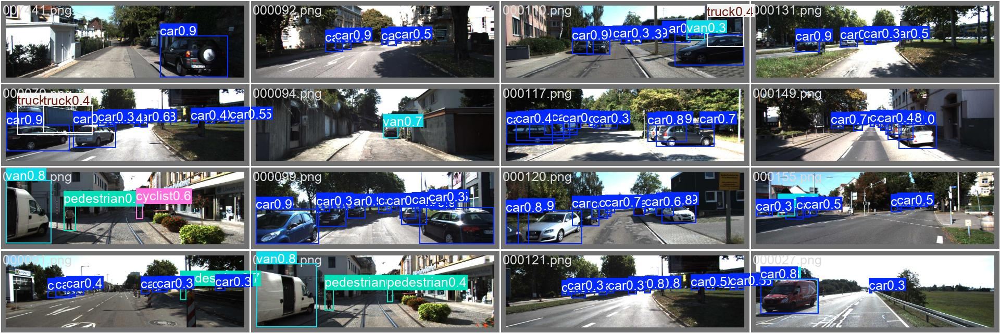

# PathFinder

[](https://github.com/Dayallenr/Autonomous-Driving/actions/workflows/ci.yml)

<!-- claims: checked -->

An autonomous-driving system developed and evaluated in the [CARLA](https://carla.org/)
simulator (0.9.16), built so that its results can be verified by anyone who
clones the repo. Every measured result in this document is a link naming the
artifact and JSON field it quotes, and a checker run in CI
([convention](docs/CLAIMS.md), claim-of-record in [CLAIMS.md](CLAIMS.md))
fails the build if a claim drifts from its evidence. Nothing here is
described from memory.

---

## The findings

**1. The standard KITTI split leaks its validation set.** KITTI's
[7481](data/manifest.json "claim:frames") object-detection frames come from
[141](data/manifest.json "claim:drives") continuous 10 Hz video drives, so
the conventional random split validates the model on scenes it trained on: a
fraction [0.34](data/manifest.json "claim:baseline_random_split.temporal_adjacency.1.fraction")
of Ultralytics' bundled validation split sits within one frame (0.1 s) of a
training frame, [0.76](data/manifest.json "claim:baseline_random_split.temporal_adjacency.2.fraction")
within two, [0.97](data/manifest.json "claim:baseline_random_split.temporal_adjacency.10.fraction")
within ten; [106](data/manifest.json "claim:baseline_random_split.drives_shared")
of [141](data/manifest.json "claim:baseline_random_split.drives_total") drives
straddle the split. This repo re-splits by drive:
[0](data/manifest.json "claim:leakage.drives_shared") drives shared between
train and val.

**2. The leak is worth ≈49 mAP points.** A legacy checkpoint trained on the
leaky split scores [0.963](results/perception/eval-yolo26m-legacy/report.json "claim:map50")
mAP@0.5 — *higher* on the "held-out" drives than its original random-split
figure, because [it had already memorised them](results/perception/eval-yolo26m-legacy/report.json "claim:prose") —
while the honestly trained YOLOv8m scores
[0.475](results/perception/yolov8m/report.json "claim:map50") on the
sequence-disjoint split. The honest number is the project's headline
detection result, and the gap is the measured price of the leak.

**3. On the road, imperfect perception costs 16 driving-score points — and
the failure mode is blindness, not caution.** In a two-arm ablation on live
CARLA (identical seeded Episodes, only perception differs), ground-truth
perception scores [25.2](results/ablation/carla_report.json "claim:baseline.summary.driving_score")
and the real detector [8.86](results/ablation/carla_report.json "claim:candidate.summary.driving_score"):
a gap of [16.34](results/ablation/carla_report.json "claim:difference.driving_score")
points. The detector arm completes *more* route
([0.481](results/ablation/carla_report.json "claim:candidate.summary.route_completion")
vs [0.396](results/ablation/carla_report.json "claim:baseline.summary.route_completion"))
but collides ten times as often
([26.5](results/ablation/carla_report.json "claim:candidate.summary.collisions_per_km")
vs [2.5](results/ablation/carla_report.json "claim:baseline.summary.collisions_per_km")
per km) — the car drives through what it cannot see.

**4. Even so, perception is not the binding constraint.** Under the
pre-registered decision rule,
[the baseline controller's own 74.8-point shortfall from a perfect score exceeds perception's 16.34](results/ablation/carla_report.json "claim:prose") —
the PurePursuit controller is the bottleneck. The planned next phase — a
learned policy trained by DAgger — was then held to a second pre-registered
gate, and the gate fired: its best available teacher, CARLA's own behaviour
agent (**not project work**), scores
[31.33](results/reference/carla_report.json "claim:summary.driving_score")
on the identical suite, clearing the PurePursuit floor
([25.2](results/reference/carla_report.json "claim:floor_gate.floor_driving_score"))
by only [6.13](results/reference/carla_report.json "claim:floor_gate.margin")
points against a required
[10.0](results/reference/carla_report.json "claim:floor_gate.required_margin").
Training was **stopped by that rule** rather than run to imitate a teacher
barely better than the floor — the gates in this project are real decision
rules, not decoration.

## Results

Every row links the artifact that produced it; the reproduction command is in
[CLAIMS.md](CLAIMS.md) next to each claim.

| Result | Value | Artifact |
|---|---|---|
| Detection, honest split (mAP@0.5 / mAP@0.5:0.95) | [0.475](results/perception/yolov8m/report.json "claim:map50") / [0.307](results/perception/yolov8m/report.json "claim:map50_95") over [1376](results/perception/yolov8m/report.json "claim:images") images, [9079](results/perception/yolov8m/report.json "claim:instances") instances | [`results/perception/yolov8m/report.json`](results/perception/yolov8m/report.json) |
| Detection, leaky-split checkpoint on the same val set | [0.963](results/perception/eval-yolo26m-legacy/report.json "claim:map50") mAP@0.5 | [`results/perception/eval-yolo26m-legacy/report.json`](results/perception/eval-yolo26m-legacy/report.json) |
| Ablation: privileged vs detector driving score | [25.2](results/ablation/carla_report.json "claim:baseline.summary.driving_score") vs [8.86](results/ablation/carla_report.json "claim:candidate.summary.driving_score") over [10](results/ablation/carla_report.json "claim:baseline.summary.episodes") seeded Episodes per arm, [0](results/ablation/carla_report.json "claim:candidate.summary.failures") failures | [`results/ablation/carla_report.json`](results/ablation/carla_report.json) |
| Detector inference in the driving loop | [8.35](results/ablation/carla_report.json "claim:candidate.mean_perception_latency_ms") ms/frame mean | [`results/ablation/carla_report.json`](results/ablation/carla_report.json) |
| CARLA determinism (full Episode, traffic + pedestrians) | two runs of seed [42](results/carla/backend_validation.json "claim:spec.seed") over [1792](results/carla/backend_validation.json "claim:episode1.steps_run") steps end at completion [0.471](results/carla/backend_validation.json "claim:episode1.final_completion") = [0.471](results/carla/backend_validation.json "claim:episode2.final_completion") | [`results/carla/backend_validation.json`](results/carla/backend_validation.json) |
| CARLA determinism (probe) and throughput | [0.0](results/carla/probe.json "claim:drive.max_divergence_m") m divergence over [120](results/carla/probe.json "claim:drive.steps") ticks; [172.0](results/carla/probe.json "claim:drive.ticks_per_second.1")–[180.85](results/carla/probe.json "claim:drive.ticks_per_second.0") ticks/sec | [`results/carla/probe.json`](results/carla/probe.json) |
| PurePursuit ceiling on a [351](results/carla/backend_validation.json "claim:episode1.route_length_m") m Town05 route | completion [0.471](results/carla/backend_validation.json "claim:episode1.final_completion"), then `agent_blocked` | [`results/carla/backend_validation.json`](results/carla/backend_validation.json) |
| gRPC coordinator latency, loopback p50 ([500](results/rpc/latency_report.json "claim:calls_per_rpc") calls/RPC) | RegisterWorker [0.26](results/rpc/latency_report.json "claim:results.0.p50_ms") ms · Heartbeat [0.26](results/rpc/latency_report.json "claim:results.1.p50_ms") ms · SubmitResult [0.26](results/rpc/latency_report.json "claim:results.2.p50_ms") ms · GetRunStatus [0.82](results/rpc/latency_report.json "claim:results.3.p50_ms") ms | [`results/rpc/latency_report.json`](results/rpc/latency_report.json) |

Per-class AP@0.5 for the honest detector: car
[0.872](results/perception/yolov8m/report.json "claim:per_class.0.ap50"),
truck [0.794](results/perception/yolov8m/report.json "claim:per_class.4.ap50"),
pedestrian [0.625](results/perception/yolov8m/report.json "claim:per_class.1.ap50"),
tram [0.529](results/perception/yolov8m/report.json "claim:per_class.6.ap50"),
van [0.442](results/perception/yolov8m/report.json "claim:per_class.2.ap50"),
cyclist [0.425](results/perception/yolov8m/report.json "claim:per_class.3.ap50"),
misc [0.106](results/perception/yolov8m/report.json "claim:per_class.5.ap50"),
person_sitting [0.005](results/perception/yolov8m/report.json "claim:per_class.7.ap50").
Two things to read alongside those numbers: the evaluation protocol is
strictly harder than published KITTI results, because
[the dataset conversion dropped difficulty tiers and DontCare regions](scripts/prepare_kitti.py "claim:prose")
so every object counts however occluded; and `person_sitting` is structurally
unmeasurable — its entire val set is
[1](results/perception/yolov8m/report.json "claim:per_class.7.drives") drive
with [56](results/perception/yolov8m/report.json "claim:per_class.7.instances")
instances, and [the report flags it low-confidence automatically](results/perception/yolov8m/report.json "claim:prose").

## What this looks like

| The leak, measured | Where the detector fails |
|---|---|
| <picture><source media="(prefers-color-scheme: dark)" srcset="results/data/split_leakage-dark.png"></picture> |  |
| Ultralytics' bundled split (orange) puts most val frames within tenths of a second of a training frame; the sequence-disjoint split (blue) has none. Rendered by `scripts/plot_data_report.py`. | The detector's problem is recall, not classification: [missed detections dominate the confusion matrix](results/perception/yolov8m/confusion_matrix.png "claim:prose"); what it does detect it rarely mislabels. |

Detections on sequence-disjoint validation frames — drives the model has
never seen:



A captured clip of a CARLA Episode will land here when it is recorded —
one command, `python -m pathfinder.demo --backend carla`, replays a
benchmarked Episode from the ablation suite, records it, and prints the
embed block for this slot ([runbook §10](docs/SETUP_WINDOWS.md), tracked
as issue #27). This README does not wait on it.

## Architecture

The driving loop is a set of small interfaces — swap any part without
touching the others:

```
EpisodeSpec (town, route, weather, seed)
    │
    ▼
SimulatorBackend ──► Perception ──► Policy ──► controls, back into the simulator each tick
 ├ kinematic         ├ privileged   ├ pure_pursuit
 │  (portable,       │  (ground     ├ cil_student (a DAgger checkpoint)
 │   no CARLA)       │   truth)     └ carla_builtin_behavior_agent
 └ CARLA 0.9.16      └ YOLOv8m +       (CARLA's own, reference only)
    (deterministic)     monocular
                        range

run_episode emits telemetry every tick ──► stream ──► Parquet warehouse
and scores the Episode by the CARLA-Leaderboard rule
(route completion × infraction penalty)
```

```
pathfinder/
  sim/         SimulatorBackend interface; kinematic backend (any laptop) and
               CARLA 0.9.16 backend; pure-geometry route tracking
  perception/  Perception protocol; privileged (ground-truth) passthrough;
               YOLO detector seam; monocular range from a detected box
  data/        KITTI provenance and the sequence-disjoint split
  detection/   per-class evaluation reports (instance/image/drive support)
  metrics/     mAP; CARLA-Leaderboard driving score
  policies.py  Policy registry: pure_pursuit, cil_student, CARLA's behaviour agent
  runner.py    one Episode: drive, emit telemetry, score
  dagger.py    DAgger loop + CLI: per-iteration checkpoints, crash-resume
  comparison.py / reference_run.py / ablation.py
               scored comparisons over the same seeded suite, each landing a
               report JSON + generated write-up
  cloud/       SQS-semantics queue (visibility timeout, DLQ), Kinesis-shaped
               telemetry stream, S3 dataset registry, Parquet warehouse,
               SageMaker-contract training
  rpc/         gRPC worker coordinator
  claims.py    the claim checker that verifies this document in CI
scripts/       KITTI preparation, training, evaluation, CARLA probe/validation
terraform/     EKS, ECR, SQS+DLQ, S3, Kinesis, KMS, IRSA, GitHub OIDC —
               validated in CI, never applied
k8s/           kind manifests + an EKS overlay
```

Design decisions with reasons are in [`docs/adr/`](docs/adr/); the project
vocabulary (what "Episode", "Probe", "Detector", "Policy" mean here) is in
[`CONTEXT.md`](CONTEXT.md).

## Quickstart — no GPU, no CARLA, no AWS

Runs on any laptop (verified on an Apple-silicon Mac, Python 3.12):

```bash
git clone https://github.com/Dayallenr/Autonomous-Driving.git PathFinder
cd PathFinder
python3.12 -m venv .venv
source .venv/bin/activate
pip install -r requirements.txt

# Drive scored, seeded Episodes on the kinematic backend, with the real
# YOLOv8m detector (CPU) in one arm — the same ablation pipeline that
# produced the CARLA numbers above.
python -m pathfinder.ablation --backend kinematic --episodes 3
```

That writes `results/ablation/kinematic_report.json` and its generated
write-up. The report labels itself **pipeline-only**: the kinematic backend
verifies the pipeline end to end, and its scores are never quoted as driving
quality — only the CARLA backend earns that.

Two more things that run anywhere:

```bash
python run_demo.py                  # the whole stack against local backends:
                                    # queue → workers → telemetry → Parquet →
                                    # datasets → training contract
pip install -r requirements-dev.txt
ruff check && pytest                # lint + the full test suite
```

The CARLA / GPU path (training the detector, driving live Episodes) is a
different machine and a different setup; it is documented once, in
[`docs/SETUP_WINDOWS.md`](docs/SETUP_WINDOWS.md). The KITTI pipeline and its
figures are documented in [`docs/DATA.md`](docs/DATA.md).

## What targets real AWS, what runs local, what was never applied

This project claims exactly what it runs, phrased the same way everywhere:

- **AWS SQS is the one live-AWS piece, and it has not run yet** — [the queue code carries real visibility-timeout and DLQ semantics](pathfinder/cloud/queue.py "claim:prose")
  and is tested against emulation; the live distributed run is scheduled
  work (issues #18/#26).
- **Kubernetes, with EKS-ready Terraform** — orchestration runs on
  [kind](k8s/kind-config.yaml "claim:prose"), **not** "deployed on EKS". All
  Terraform ([EKS](terraform/eks.tf "claim:prose"), ECR, SQS+DLQ, S3, KMS,
  IRSA, GitHub OIDC) is validated in CI and has **never been applied to real
  AWS**; nothing in this repo has ever provisioned a paid cloud resource.
- **Kinesis, never applied to real AWS** —
  [provisioned in Terraform and exercised against moto](terraform/kinesis.tf "claim:prose");
  the default telemetry backend is local.
- **SageMaker SDK in local mode** —
  [the real SageMaker SDK, local Docker, zero spend](pathfinder/cloud/training.py "claim:prose").
- **The behaviour-agent baseline is not project work** —
  [`carla_builtin_behavior_agent` is CARLA's own behaviour agent](pathfinder/policies.py "claim:prose"):
  its driving score is a reference upper bound only, and it has never been
  run against a live server.

## Known limitations

Stated here because honesty is the feature, not the disclaimer:

- **The baseline controller is the bottleneck.** PurePursuit completes
  [0.471](results/carla/backend_validation.json "claim:episode1.final_completion")
  of a [351](results/carla/backend_validation.json "claim:episode1.route_length_m") m
  Town05 route before `agent_blocked` —
  [a driving-quality ceiling of the controller, not a backend defect](results/carla/backend_validation.json "claim:prose").
  Any comparison against it is a low bar, and the comparison artifacts say so.
- **Monocular range saturates in the near field.** Below the camera's
  `min_measurable_range_m` the obstacle's ground contact leaves the frame and
  the estimate over-reads — the unsafe direction. The floor is exposed on
  `CameraGeometry` and [pinned by a test so it cannot regress into a claim that the near field works](tests/test_range_geometry.py "claim:prose").
- **The detector in CARLA is out-of-domain.**
  [It was trained on real KITTI imagery and driven on synthetic scenes](results/ablation/carla_report.json "claim:prose");
  the ablation quantifies the cost rather than hiding it.
- **[No learned policy has been trained, and none will be under the current plan](pathfinder/dagger.py "claim:prose").**
  The DAgger loop, checkpointing, and scored comparison are proven CARLA-free
  with untrained weights and kept as pipeline machinery; training was stopped
  when its pre-registered teacher-quality gate returned stop-and-reassess
  (issues #16, #11).
- **`person_sitting` is structurally unmeasurable** on this split (one
  validation drive), as covered under the results table.

## Reproducibility as a mechanism

- **Seeded Episodes.** An `EpisodeSpec` carries town, route, weather, and
  seed; suites are generated from a base seed, so any Episode can be re-driven.
- **Bit-reproducible CARLA.** Two runs of one seed diverge by
  [0.0](results/carla/probe.json "claim:drive.max_divergence_m") m — but only
  with fixed delta, synchronous mode, a seeded traffic manager **and**
  [`world.set_pedestrians_seed()`](pathfinder/sim/carla_backend.py "claim:prose")
  together; the last is easy to miss and without it identical seeds diverge.
  Verified over full Episodes with traffic and pedestrians, not just the probe.
- **Reports and write-ups land together.** Every scored suite produces a report JSON
  (the artifact) and a generated Markdown write-up rendered from it; golden
  tests pin the generators.
- **Claims are checked in CI.** Every number in this document and in
  [CLAIMS.md](CLAIMS.md) is a link naming its artifact and field, verified by
  `pathfinder/claims.py` on every push. Audit coverage yourself:
  `python -m pathfinder.claims`.

## Contributing / working conventions

Work is tracked as GitHub issues on this repo (conventions in
[`docs/agents/`](docs/agents/)). Architecture decisions live in
[`docs/adr/`](docs/adr/), the domain vocabulary in
[`CONTEXT.md`](CONTEXT.md), and the claim-of-record in
[`CLAIMS.md`](CLAIMS.md) — a new claim lands there before it lands anywhere
else, this document included.
