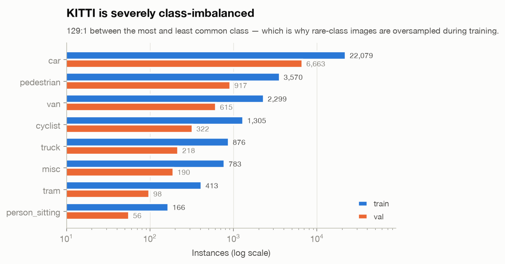
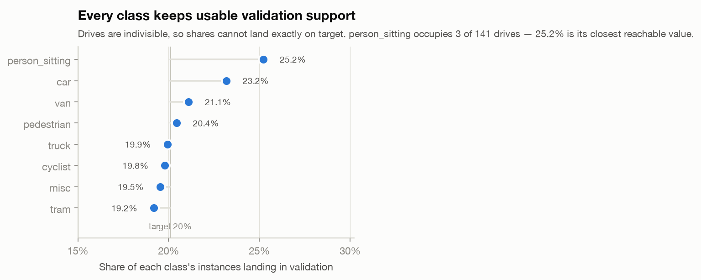

# KITTI data pipeline

Everything here is produced by two commands. No number in this document was
typed by hand; each is read from `data/manifest.json`.

```bash
python scripts/prepare_kitti.py --report-baseline   # download, split, rebalance
python scripts/plot_data_report.py                  # render results/data/*.png
```

Both are idempotent and deterministic: a completed download is reused, and
re-running produces byte-identical split files.

---

## The headline finding

**The conventional KITTI split leaks its validation set.**

KITTI's 7,481 detection images are not independent samples. They are frames
drawn from **141 continuous 10 Hz video drives**. The standard approach —
shuffle the 7,481 filenames, take 80/20 — scatters frames from the same drive
across both sides, so the model is validated on scenes it trained on.

Measured against the split shipped in Ultralytics' bundled `kitti.yaml`:

| Validation frames within… | of a training frame | Random split | Sequence-disjoint |
|---|---|---|---|
| ±1 frame | 0.1 s | **34.0%** | 0.0% |
| ±2 frames | 0.2 s | **76.3%** | 0.0% |
| ±3 frames | 0.3 s | 83.3% | 0.0% |
| ±5 frames | 0.5 s | 88.6% | 0.0% |
| ±10 frames | 1.0 s | **97.0%** | 0.0% |

106 of 141 drives straddle that split. A third of its validation set is
effectively the same photograph as a training image, and 97% is within one
second.


**Consequence for this repo.** The pre-existing checkpoint reports
**mAP@0.5 = 0.919** on the random split. That figure is not comparable to
published KITTI results and is not the number this project reports. Models are
retrained and evaluated on the sequence-disjoint split instead, and the number
that comes out — whatever it is — is the one that goes in the README.

---

## Recovering frame provenance

Splitting by drive requires knowing which drive each detection frame came from.
KITTI ships two devkit files that recover it, and they compose in a specific
order that is easy to get backwards:

| File | Contents |
|---|---|
| `train_rand.txt` | A permutation. Entry *i* (0-based) is the **1-based line number** in `train_mapping.txt` for image `{i:06d}.png`. |
| `train_mapping.txt` | One line per frame: `<date> <drive> <raw_frame>`. |

So `000000.png` → `train_rand[0]` = 7282 → line 7282 of `train_mapping.txt` =
`2011_09_28 2011_09_28_drive_0106_sync 0000000048`. This matches the documented
example in the KITTI devkit README, and `tests/test_kitti_data.py` pins the
composition order so a silent inversion cannot pass.

Both files are fetched automatically by `prepare_kitti.py`.

---

## The split

Whole drives are assigned to one side or the other, targeting 20% validation.

| | Frames | Drives |
|---|---|---|
| train | 5,978 | 126 |
| val | 1,503 | 15 |
| **total** | **7,481** | **141** |

Drives straddling the split: **0**.

### Why this needs an optimizer

Assigning drives by size alone starves rare classes. The objective is a squared
deviation from the 20% target with two terms — overall frame count, and
per-class instance share weighted by `1/sqrt(instances)` so rare classes count
for more — plus a hard penalty for leaving any class with zero instances on
either side.

Three findings from building it, each recorded as a regression test:

1. **Zero-support is a constraint, not a small error.** Squared deviation alone
   will *choose* to starve a class. If a class occupies whole drives, its
   achievable validation shares are coarse — say {0%, 50%, 100%} — and
   |0 − 20%| beats |50% − 20%|, so the optimizer picks zero validation
   instances as the tidier number. AP is then undefined for that class. Hence
   `STARVED_CLASS_PENALTY`.

2. **Swap moves are required, not an optimization nicety.** Reaching a class's
   best achievable share usually means exchanging one drive for another, and
   each half of that exchange raises the cost on its own. A move-only hill climb
   sits in its local optimum forever — it reached 7.7% for `person_sitting`
   where 25.2% was available.

3. **Restarts are required too.** Even move+swap stalls, because some escapes
   need a *compound* move. The drive holding 67% of `person_sitting` also held
   the only `tram` instances on the validation side, so trading it away starved
   `tram` unless another tram drive moved in simultaneously. 40 seeded random
   restarts fix this while keeping the result reproducible.

---

## Class distribution and imbalance

KITTI is severely imbalanced — **129:1** between `car` and `person_sitting`.



| Class | Train | Val | Val share |
|---|---:|---:|---:|
| car | 22,079 | 6,663 | 23.2% |
| pedestrian | 3,570 | 917 | 20.4% |
| van | 2,299 | 615 | 21.1% |
| cyclist | 1,305 | 322 | 19.8% |
| truck | 876 | 218 | 19.9% |
| misc | 783 | 190 | 19.5% |
| tram | 413 | 98 | 19.2% |
| person_sitting | 166 | 56 | 25.2% |

Every class lands between 19.2% and 25.2% against a 20% target.



### A limitation that cannot be engineered away

`person_sitting` occupies **3 of 141 drives**, with 67% of its instances in a
single drive. Its only achievable validation shares are 0%, 7.7%, 25.2%, 32.9%,
67.1%, and so on — 25.2% is the closest reachable value to 20%.

**Therefore `person_sitting` AP rests on 56 instances drawn from a single
drive** (`2011_09_26_drive_0091_sync`). Those instances are frames of one
continuous scene, not 56 independent observations, so the effective sample size
is far smaller than the count suggests and the resulting AP is high-variance.
`tram` is milder but shares the shape: 98 instances across 2 drives.

Reporting either beside `car` AP (6,663 instances spanning most of the corpus)
as though they carry equal weight would be misleading. Per-class AP tables in
this repo therefore carry instance **and** drive counts, and conclusions are not
drawn from single-drive classes.

---

## Rebalancing for training

Rare-class images are **oversampled** — repeated in the training file list —
rather than augmented by pasting:

| | |
|---|---|
| Unique training images | 5,978 |
| Sampled entries | 6,568 |
| Repeat factors | `person_sitting` ×6, `tram` ×2 |
| Cap | 8 (not reached) |

Two decisions worth stating:

- **Why repetition, not copy-paste.** Ultralytics' `copy_paste` augmentation
  requires segmentation masks. KITTI detection labels are boxes only, so pasting
  would mean compositing rectangles with wrong occlusion, lighting, and ground
  contact — synthetic artifacts a detector learns to key on.
- **Why the cap.** Uncapped, a 129:1 ratio asks for ~129 copies of 99 images.
  The model then memorizes those specific scenes rather than learning the class.
  8 is a deliberate under-correction.

An image's repeat count is driven by its **rarest** class: an image holding one
`person_sitting` and six `car` is valuable for the former, and the cars it drags
along are already abundant enough not to matter.

**Oversampling is applied to training only.** The validation list is one entry
per image — repeating validation images would weight the metric toward
duplicated scenes and inflate exactly the classes the repetition targeted.

---

## Outputs

| Path | Contents | Tracked |
|---|---|---|
| `data/raw/` | Images, YOLO labels, devkit mapping files | no (390 MB) |
| `data/splits/train.txt` | Training image paths, rare classes oversampled | no (absolute paths) |
| `data/splits/val.txt` | Validation image paths, one per image | no (absolute paths) |
| `data/kitti_seqdisjoint.yaml` | Ultralytics dataset config | no (generated) |
| `data/manifest.json` | Split, distribution, leakage measurements | **yes** |
| `results/data/*.png` | Figures, light and dark | **yes** |

`manifest.json` is tracked because it names which drives went where. Without it
a metric cannot be traced back to the data behind it.

### Label schema

YOLO format, one `.txt` per image, one line per object:

```
<class_id> <x_center> <y_center> <width> <height>
```

All four geometry values are normalized to `[0, 1]` against image dimensions.
Class ids follow the KITTI ordering:

| id | class | id | class |
|---|---|---|---|
| 0 | car | 4 | person_sitting |
| 1 | van | 5 | cyclist |
| 2 | truck | 6 | tram |
| 3 | pedestrian | 7 | misc |

Every one of the 7,481 images carries at least one label; there are no empty
label files and no missing image/label pairs. `prepare_kitti.py` raises rather
than proceeding if either invariant breaks, since a short read would silently
shrink the dataset and every downstream number with it.

### Classes not present

KITTI's raw annotations include a `DontCare` region marking objects that were
left unlabeled. It is absent from this 8-class YOLO conversion. Detections
falling in those regions are therefore scored as false positives rather than
ignored — which makes reported precision a *lower bound* against benchmarks that
honor `DontCare` masking.
